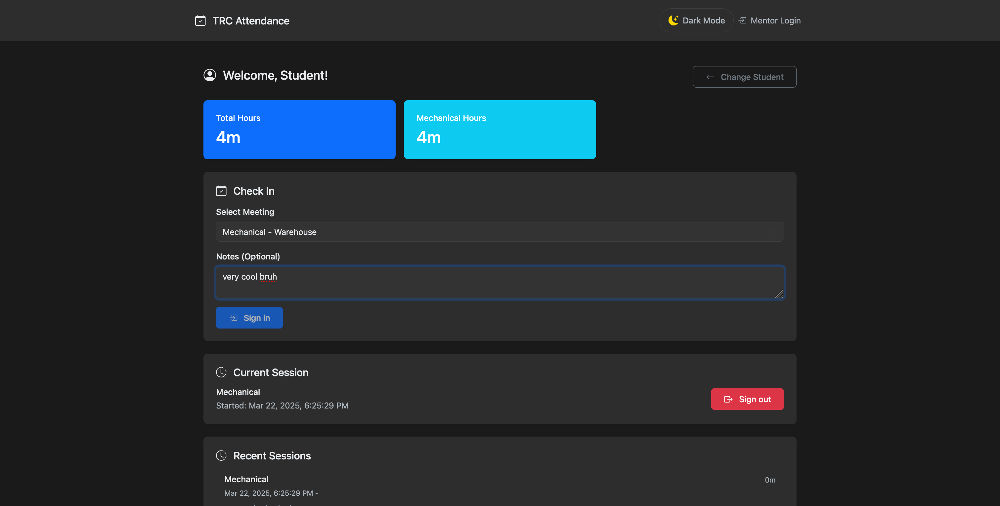
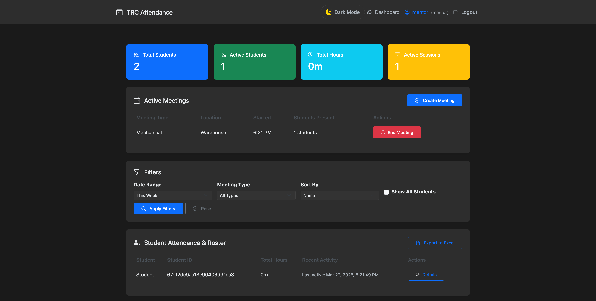

# TRAC

A web application for managing student attendance and mentoring sessions at Titan Robotics Club. Built with Angular (frontend) and Node.js/Express (backend).





## 🌟 Features

- **Student Quick Registration & Check-in**
  - Fast registration process for new students
  - Easy check-in/out system with meeting type selection
  - User ID tracking and validation

- **Mentor Dashboard**
  - Real-time view of current attendance
  - Meeting management and type selection
  - Historical attendance data and statistics

- **Admin Panel**
  - User management (students, mentors, admins)
  - Meeting type configuration

- **Authentication & Authorization**
  - Role-based access control (Student, Mentor, Admin)
  - Protected routes and API endpoints

## 🚀 Getting Started

### Prerequisites

- Node.js (v18 or higher)
- MongoDB (v6.0 or higher)
- Angular CLI (v17 or higher)
- Git

### Installation

1. **Clone the Repository**
   ```bash
   git clone 
   cd trc-attendance
   ```

2. **Backend Setup**
   ```bash
   # Navigate to backend directory
   cd backend

   # Install dependencies
   npm install

   # Create .env file
   cp .env.example .env

   # Update .env with your configuration
   # Edit .env file with your preferred editor and add:
   # - PORT=
   # - JWT_SECRET=
   # - MONGODB_URI=
   # - MENTOR_CODE=
   # - ADMIN_CODE=
   ```

3. **Frontend Setup**
   ```bash
   # Navigate to frontend directory
   cd ../frontend/trc-attendance-client

   # Install dependencies
   npm install
   ```

### Running the Application

1. **Start Backend Server**
   ```bash
   # In backend directory
   npm run dev
   ```
   Server will start on http://localhost:3000

2. **Start Frontend Development Server**
   ```bash
   # In frontend directory
   ng serve
   ```
   Application will be available on http://localhost:4200

## 🛠️ Development

### Project Structure

```
trc-attendance/
├── backend/                 # Node.js/Express backend
│   ├── src/
│   │   ├── controllers/    # Request handlers
│   │   ├── models/        # MongoDB schemas
│   │   ├── routes/        # API routes
│   │   ├── middleware/    # Custom middleware
│   │   └── app.js        # Main application file
│   └── package.json
│
└── frontend/
    └── trc-attendance-client/
        ├── src/
        │   ├── app/
        │   │   ├── core/          # Core modules & services
        │   │   ├── shared/        # Shared components
        │   │   ├── student/       # Student feature module
        │   │   ├── mentor/        # Mentor feature module
        │   │   └── admin/         # Admin feature module
        │   └── assets/
        └── package.json
```

### Code Style Guide

- Use TypeScript's strict mode
- Follow Angular style guide for frontend code
- Use ESLint and Prettier for code formatting
- Write meaningful commit messages following conventional commits

### Adding New Features

1. **Backend**
   - Create new model in `backend/src/models/`
   - Add controller in `backend/src/controllers/`
   - Define routes in `backend/src/routes/`
   - Update API documentation

2. **Frontend**
   - Create feature module if needed
   - Add components in appropriate module
   - Update services in `core/services`
   - Add routes in module routing file

### Testing

```bash
# Run backend tests
cd backend
npm test

# Run frontend tests
cd frontend/trc-attendance-client
ng test
```

## 📦 Building for Production

### Backend
```bash
cd backend
npm run build
```

### Frontend
```bash
cd frontend/trc-attendance-client
ng build --configuration production
```

## 🤝 Contributing

1. Fork the repository
2. Create your feature branch (`git checkout -b feature/AmazingFeature`)
3. Commit your changes (`git commit -m 'Add some AmazingFeature'`)
4. Push to the branch (`git push origin feature/AmazingFeature`)
5. Open a Pull Request

## 📝 API Documentation

API documentation is available at `/api-docs` when running the backend server in development mode.

## 📫 Support

For support, open an issue in the repository.

## 📄 License

This project is licensed under the MIT License.